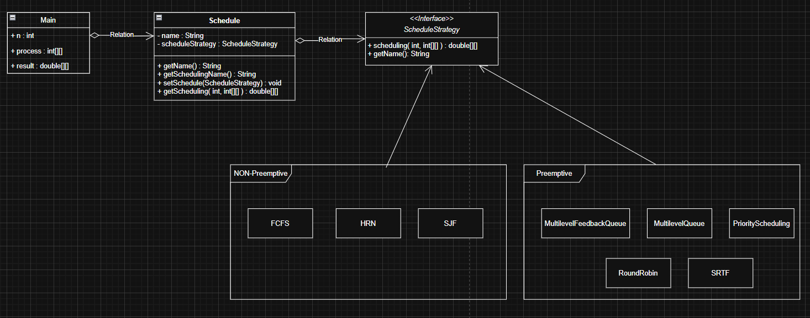
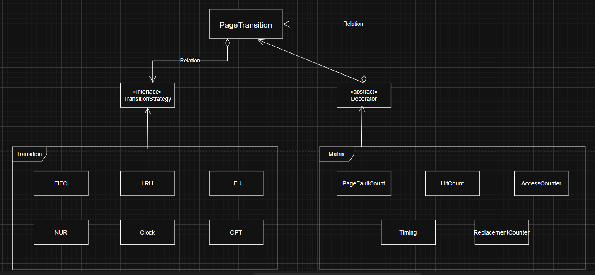

# OS Algorithm ( Scheduling, Transition )
단일 컴퓨터를 위해 존재하는 OS의 알고리즘을 현대의 클라우드 시스템에 맞춰서 백엔드 시스템에 응용하기 위해 CPU 스케줄링과 메모리 교체 알고리즘을 구현해서 실험한 레포지토리입니다.  

Spring 환경에서 활용하기 위해서 java 언어로 구현됐습니다.

---

### Code Architecture

#### CPU Scheduling

서비스의 특성에 맞춰서 트래픽 처리 요구와 성능을 높이기 위해서 CPU 스케줄링 알고리즘을 구현했습니다.  
실험 환경은 유연한 알고리즘 교체를 위해서 스트래티지 패턴으로 설계했습니다.  

Spring Cloud gateway에서 사용해볼 수 있습니다.

#### Memory Transition

서비스의 특성에 맞춰서 케시 시스템의 효율과 성능을 올리기 위해서 메모리 교체 알고리즘을 구현했습니다.  
실험 환경은 알고리즘 교체를 위해 1차적으로 스트래티지 패턴으로 설계했고, 다양한 Matrix를 위해서 데코레이터 패턴으로 설계했습니다.  

Spring boot Cache에서 사용해볼 수 있습니다.

